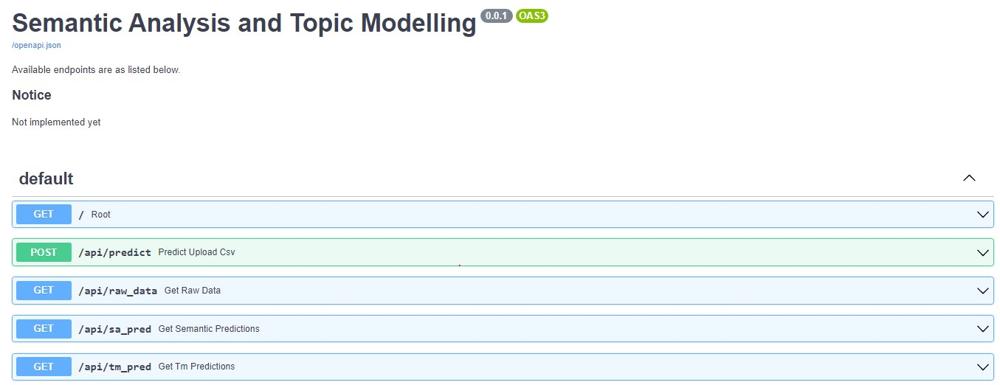
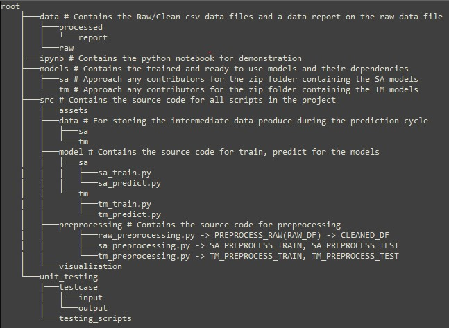

# DSA4263: Voice of the Customer (VoC) Analysis
### Team CAJN

## Introduction

The Voice of the Customer (VoC) is a methodology used to capture customers’ needs, requirements, and perceptions about products or services. In this project, we seek to develop and end-end solution for Voice of Customer analysis to provide insights to end business users using a public customer feedback dataset.

## Installation

1. **Docker**

    Run  

    ```bash
    docker build -t api .
    ```  

    For MAC/Linux:

    ```bash
    docker run -d -p 5000:5000 -v ${pwd}:/app api
    ```

    For Windows:

    ```bash
    docker run -d -p 5000:5000 -v ${PWD}:/app api
    ```

2. **Virtual Environment**

- Create a virtual environment of your choice; eg:

```bash
virtualenv venv
```

- Activate virtual environment & Install dependencies

```bash
source venv/Scripts/activate
```

```bash
pip install -r requirements.txt
```

- Run the API with

```bash
uvicorn --app-dir=./root/src main:app --port 5000
```

The app is hosted on -
```localhost (127.0.0.1)``` at port ```5000```. API documentation is available at ```127.0.0.1:5000/docs```



Usage example can be found in the [api_demo notebook](https://github.com/nivii26/DSA4263-Voice-of-Customer-VOC-analysis/blob/main/root/ipynb/api_demo.ipynb)

## Task Breakdown

Before executing any of the code in the following tasks, run the code for general preprocessing:
```
python root/src/preprocessing/rawdata_preprocessing.py
```

### TASK 1 : Sentiment Analysis

View this notebook ['sentiment_analysis_demo'](https://github.com/nivii26/DSA4263-Voice-of-Customer-VOC-analysis/blob/main/root/ipynb/sentiment_analysis_demo.ipynb) for a step-by-step demo of this subtask.

**Preprocessing**: Our preprocessing methodology for Sentiment Classification is to generate word embeddings for the 'Text' column in reviews.csv by concatinating the embeddings generated from Word2vec and TF-IDF (Term Frequency - Inverse Document Frequency). We then apply PCA (Principal Component Analysis) to reduce the dimensionality of the embedding space. This step can help to speed up the subsequent analysis while still retaining the important features of the text.

To run the preprocessing step run -

```bash
python root/src/preprocessing/sa_preprocessing.py root/data/raw/sample_RAW_DF_train.csv
```
Note: Modify 2nd argument, to be the path to a raw dataframe with columns ['Time', 'Sentiment', 'Text']

**Training**: We experiment with several classification models such as the Naive Baye's Classifier, Logistic Regression, SVM (Support Vector Machine), XGBoost and pretrained models like Vader and Falir. View the table below for relative perfromace of these models on the test data (from train-test split) and our inference -
Performance Comparision Table

|    Model             |    Weighted F1 (train)    |       Weighted F1 (Test)| PR_AUC (TRAIN) | PR_AUC (TEST) |  Evaluation|
| -----------          | -----------               | -----------             |-----------     |-----------    |   -----|
|  Naive Baye's        |    0.72   |     0.54 |      0.81      | 0.72  | Overfit train data (Baseline performance) |
|  Logistic Regression |    0.88                   |    0.86                     |      0.96      | 0.96    | Good but SVM performs better |
|   Non - Linear SVM   |    0.9                    |     0.87                    |      0.97      | 0.97    | Best Performance (with our own pre-processing)|
|   XGBoost            |    0.9                    |     0.79                    |      0.96      | 0.94   | Overfit train data|
|   Vader              |    0.80                   |     0.87                    |      0.93      | 0.94   | Rule-based, not the best approach|
|   Flair              |    0.94                   |      0.93                   |      0.99      | 0.99   | Best perfromance (pretrained)|

The two best perfroming models were Non-Linear SVM and Flair based on the above metrics of 'weighted F1 score' and 'PR-AUC'. Hence our, final model is an ensemble of these two models based on aggregration (average).

To train new data using our methodology, run -

```bash
python root/src/model/sa/sa_train.py
```

**Predict**: The prediction method takes a preprocessed DataFrame (fot SVM) and original cleaned up text (for the model 'Flair') as input. The output is a DataFrame with the the sentiment_labels and probabilities from the two individual models and the final_sentiment and final_probability from the ensembling process, which are our final sentiment predictions.

To obtain predictions, run -

```bash
python root/src/model/sa/sa_predict.py root/data/raw/sample_RAW_DF.csv
```
Note: Modify 2nd argument, to be the path to a raw dataframe with columns ['Time', 'Text']

### TASK 2 : Topic Modeling

View this notebook ['topic_modelling'](https://github.com/nivii26/DSA4263-Voice-of-Customer-VOC-analysis/blob/main/root/ipynb/topic_modelling.ipynb) for a step-by-step demo of this subtask.

**Preprocessing**: Run topic modelling specific preprocessing. (This will create a file with embeddings root/src/data/sa/file features_train_sa.csv)
```
python root/src/preprocessing/tm_preprocessing.py
```
Topic modelling's preprocessing continues from raw data preprocessing by performing some light cleaning and lemmatisation.

**Training**: 
We considered the following topic models: LDA, NMF, LSA. Our final topic model was decided using both quantitative and qualitative evaluation. 

- Quantitative: We experimented with hyperparameters such as the word embedding method and the number of topics to find the top ranking topic models based on CV coherence. Number of topics used ranged from 5 to 15.
- Qualitative: From among the top performing models, we selected the configuration for our final model by picking the model that generated topics which seemed to best represent the general content of the entire corpus. This selection was purely manual.
 
The configuration for the training hyperparameters of the final model is specified in [config.yml file](https://github.com/nivii26/DSA4263-Voice-of-Customer-VOC-analysis/tree/main/root/src/model/tm/config.yml). To train the topic model, run: 
```
python -m root.src.model.tm.tm_train
```
This will train and deposit the chosen topic model into root/models/tm/.

### TASK 3 : Visualization

To load the visualisation locally, ensure that the packages streamlit and Circlify (in the requirements.txt) are already installed.

Run the following command in the terminal to access the dashboard through a local host.

```bash
streamlit run root/src/visualization/visualize.py <path_to_file_to_visualize>
```

Alternatively, view ['this repository'](https://github.com/nivii26/VoC-streamlit-app) for a demo of our streamlit app!

Click ['here'](https://share.streamlit.io/app/nivii26-voc-streamlit-app-visualize-9xla2m/) to access a demo_dashboard

## Repository Breakdown


